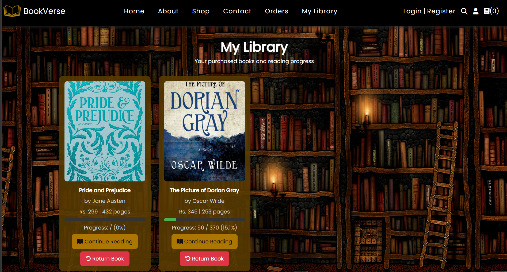
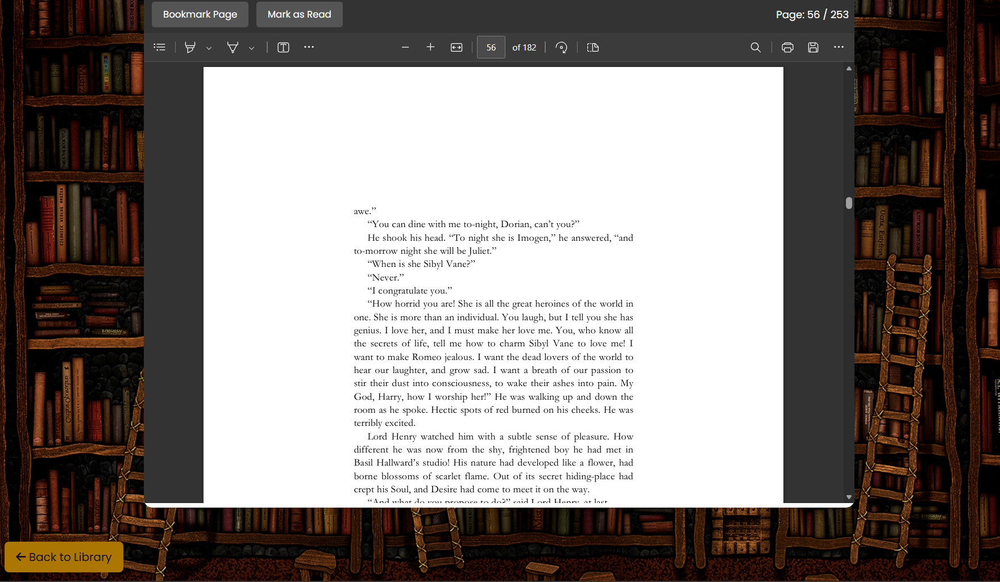

<div align="center">

# 📚 BookVerse

### A full-stack online bookstore & e-reading platform built with PHP & MySQL

[](https://php.net)
[](https://mysql.com)
[](https://stripe.com)
[](https://docker.com)
[](https://render.com)

[Features](#-features) · [Screenshots](#-screenshots) · [Tech Stack](#-tech-stack) · [Getting Started](#-getting-started) · [Routes](#-key-routes) · [Folder Structure](#-folder-structure)

**[🔗 Live Demo](https://bookverse-5set.onrender.com/)**

</div>

---

## 🎯 Overview

BookVerse is a full-stack online bookstore that goes beyond "add to cart, checkout." A purchased book unlocks an in-browser reader that tracks reading progress per user, per book, and file access is gated server-side so a free sample and a paid book are never served the same way.

Built as a complete PHP + MySQL application, it demonstrates end-to-end web product development: secure session-based authentication, Stripe payment integration, server-side access control on file delivery, and a full admin back office — containerized with Docker and deployed live.

---

## ✨ Features

- 🔐 **Authentication** — Session-based login & registration, with every protected page validating access server-side
- 🏠 **Storefront** — Browse and search the full catalogue with book detail pages and free sample previews
- 🛒 **Cart & Checkout** — Stripe Checkout integration end-to-end, from cart to order confirmation
- 📦 **Order History** — Track past purchases
- 📖 **In-Browser Reader** — Read purchased books directly in the browser, with reading progress saved per user, per book
- 🔖 **To-Be-Read List** — Save books to read later
- 📚 **My Library** — Personal collection of everything a user has purchased
- 🔒 **Gated File Delivery** — Sample PDFs are public; full books require a verified purchase before the file is served
- 🛠 **Admin Panel** — Manage products, orders, users, and incoming contact messages
- 📬 **Contact Form** — Direct messaging to the admin panel

---

## 📱 Screenshots

### Storefront

<table>
  <tr>
    <td align="center"><b>Home</b></td>
    <td align="center"><b>Book Details</b></td>
  </tr>
  <tr>
    <td></td>
    <td></td>
  </tr>
</table>

### Shopping & Checkout

<table>
  <tr>
    <td align="center"><b>Cart</b></td>
    <td align="center"><b>Checkout</b></td>
  </tr>
  <tr>
    <td></td>
    <td></td>
  </tr>
</table>

### Reading Experience

<table>
  <tr>
    <td align="center"><b>My Library</b></td>
    <td align="center"><b>In-Browser Reader</b></td>
  </tr>
  <tr>
    <td></td>
    <td></td>
  </tr>
</table>

### Admin

<table>
  <tr>
    <td align="center"><b>Admin Panel</b></td>
  </tr>
  <tr>
    <td></td>
  </tr>
</table>

*(Add screenshots to the `/screenshots` folder using the filenames above, or edit the paths to match your own.)*

---

## 🛠 Tech Stack

| Layer | Technology |
|---|---|
| Backend | PHP 8.2, vanilla (no framework) |
| Database | MySQL, accessed via MySQLi with prepared statements |
| Payments | Stripe Checkout (`stripe/stripe-php`) |
| Containerization | Docker (`php:8.2-apache`) |
| Hosting | Render (app) + external managed MySQL |

---

## 📁 Folder Structure

```
BookStore/
├── admin_header.php
├── admin_messages.php          # Admin: contact messages
├── admin_orders.php            # Admin: order management
├── admin_page.php              # Admin: dashboard
├── admin_products.php          # Admin: product management
├── admin_users.php             # Admin: user management
├── about.php
├── book_details.php            # Book detail page
├── cancel.php                  # Stripe cancel redirect
├── cart.php
├── checkout.php
├── config.php                   # DB connection + Stripe keys (env vars)
├── contact.php
├── create_checkout_session.php  # Stripe Checkout session creation
├── footer.php
├── home.php                     # Storefront home
├── library.php
├── login.php
├── logout.php
├── my_library.php               # Purchased books
├── orders.php                   # Order history
├── pdf_access.php               # Access-controlled file serving
├── reader.php                   # In-browser PDF reader
├── register.php
├── search_page.php
├── shop.php
├── success.php                  # Stripe success redirect
├── user_header.php
├── index.php                    # Entry point → redirects to home.php
├── dbqueries                    # Full MySQL schema
├── uploaded_img/                # Book cover images (seed data)
├── uploaded_pdf/                # Full book PDFs
├── uploaded_samples/            # Sample/preview PDFs
├── screenshots/                 # README screenshots
├── Dockerfile
└── composer.json
```

---

## 🚀 Getting Started

### Prerequisites

- PHP `>=8.2`
- MySQL
- Composer
- `mysqli` and `pdo_mysql` PHP extensions

### Local Setup

```bash
git clone https://github.com/arya-lunawat/BookStore.git
cd BookStore
composer install
```

Create a database and import the schema:

```bash
mysql -u <user> -p <database_name> < dbqueries
```

Set environment variables:

```env
MYSQLHOST=localhost
MYSQLUSER=<your-mysql-user>
MYSQLPASSWORD=<your-mysql-password>
MYSQLDATABASE=<your-database-name>
MYSQLPORT=3306
STRIPE_SECRET_KEY=<your-stripe-test-secret-key>
STRIPE_PUBLISHABLE_KEY=<your-stripe-test-publishable-key>
```

Serve the app:

```bash
php -S localhost:8000
```

### Run with Docker

```bash
docker build -t bookstore .
docker run -p 80:80 \
  -e MYSQLHOST=<host> -e MYSQLUSER=<user> -e MYSQLPASSWORD=<password> \
  -e MYSQLDATABASE=<database> -e MYSQLPORT=3306 \
  -e STRIPE_SECRET_KEY=<key> -e STRIPE_PUBLISHABLE_KEY=<key> \
  bookstore
```

---

## 🗺️ Key Routes

| Page | Description | Auth |
|---|---|---|
| `home.php` | Storefront home | ✅ |
| `shop.php` | Browse catalogue | ✅ |
| `search_page.php` | Search books | ✅ |
| `book_details.php?id={id}` | Book detail page | ✅ |
| `cart.php` | View/edit cart | ✅ |
| `checkout.php` | Checkout page | ✅ |
| `create_checkout_session.php` | Creates Stripe Checkout session | ✅ |
| `success.php` / `cancel.php` | Stripe redirect handlers | ✅ |
| `my_library.php` | Purchased books | ✅ |
| `reader.php?id={id}` | In-browser reader | ✅ |
| `pdf_access.php?id={id}` | Serves gated PDF file | ✅ |
| `orders.php` | Order history | ✅ |
| `login.php` / `register.php` | Auth pages | ❌ |
| `admin_page.php` | Admin dashboard | ✅ (admin) |

> ✅ = Requires an active login session; unauthenticated requests are redirected to `login.php`

---

## ☁️ Deployment

Live at **[bookverse-5set.onrender.com](https://bookverse-5set.onrender.com/)** — deployed as a Docker container on Render, against an external managed MySQL instance. The [`Dockerfile`](./Dockerfile):

- Installs `mysqli` and `pdo_mysql` PHP extensions and Composer dependencies (`stripe/stripe-php`)
- Explicitly forces Apache's `mpm_prefork` at container start — a fix for a known MPM conflict on some container platforms using the `php:apache` base image
- Reads all DB and Stripe credentials from environment variables; nothing sensitive is committed to the repo

---

## 🔒 Security

- All database queries use prepared statements with parameter binding (MySQLi `prepare`/`bind_param`) — no string-concatenated SQL
- Every session-gated page validates `$_SESSION['user_id']` safely and halts execution (`exit`) on an unauthenticated request, rather than relying on `header()` alone
- File access to purchased PDFs is verified server-side against the `purchased_books` table before serving
- Debug and seeding scripts used during development have been removed from the repository
- **Known issue, in progress:** passwords are currently hashed with MD5 in `login.php`/`register.php`; migrating to PHP's `password_hash()`/`password_verify()` is the next planned fix

---

## 🗺 Roadmap

- [ ] Migrate password storage from MD5 to `password_hash()`
- [ ] Move book cover/PDF uploads to persistent object storage (S3-compatible) so they survive redeploys
- [ ] Add automated tests around checkout and access-control logic

---

## 👨‍💻 Author

**Arya Lunawat** <br>
MBA Tech | NMIMS Indore

[](https://github.com/arya-lunawat)

---

<div align="center">
  <sub>Built with PHP, MySQL, and Stripe</sub>
</div>
